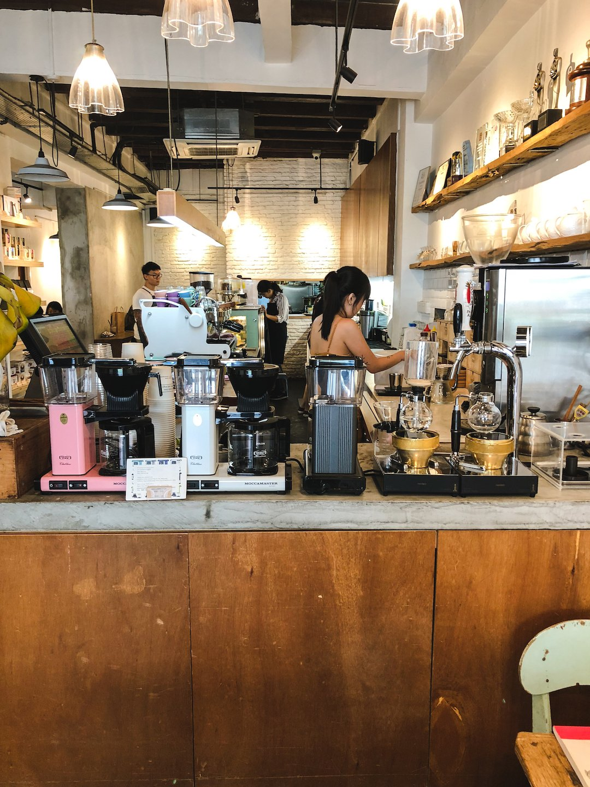
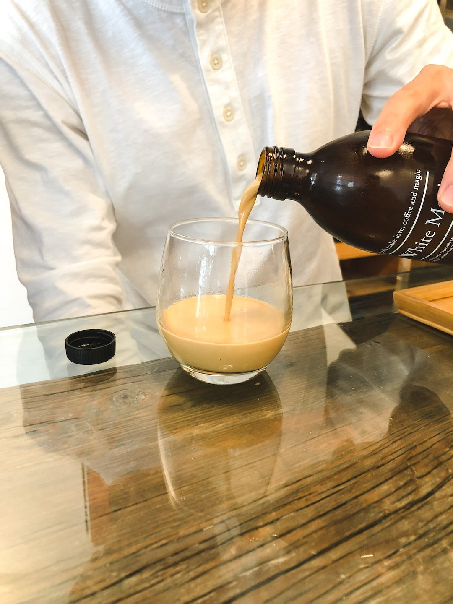
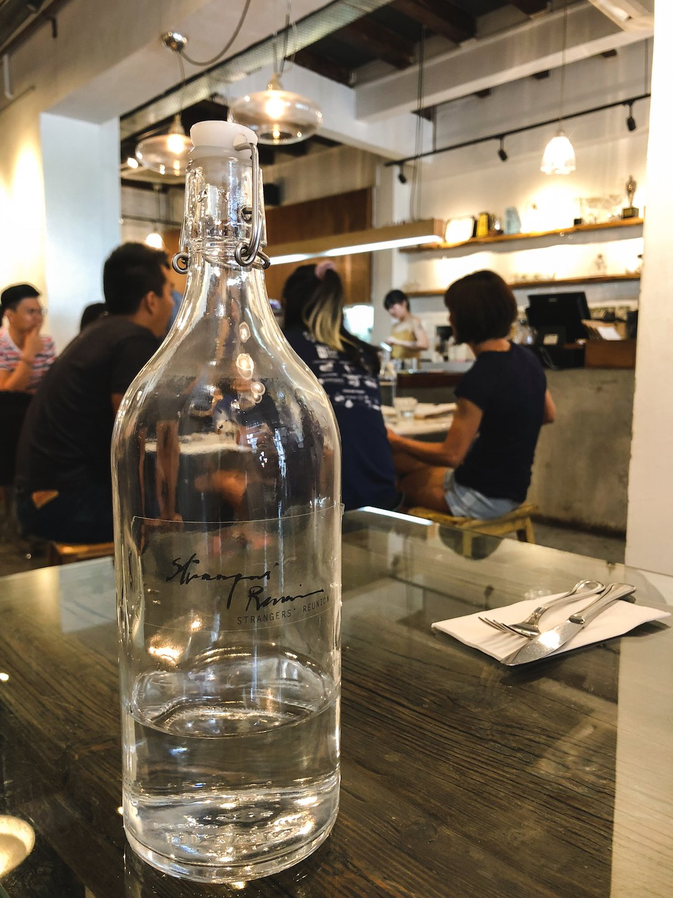
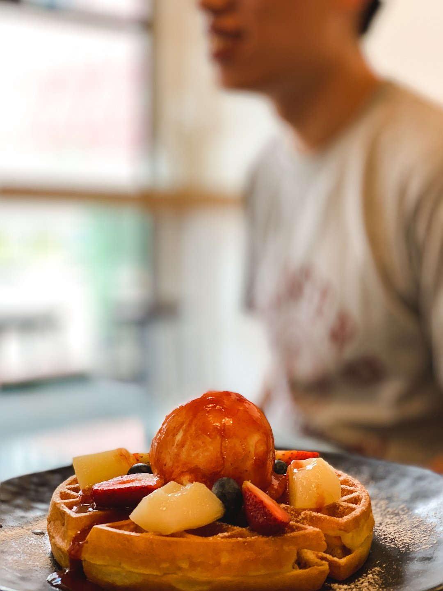
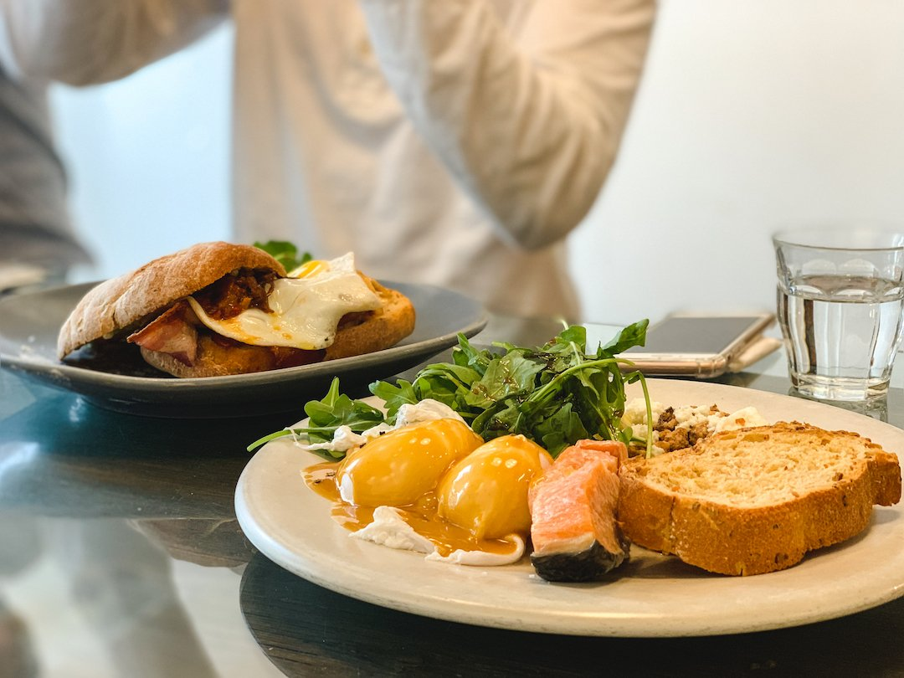
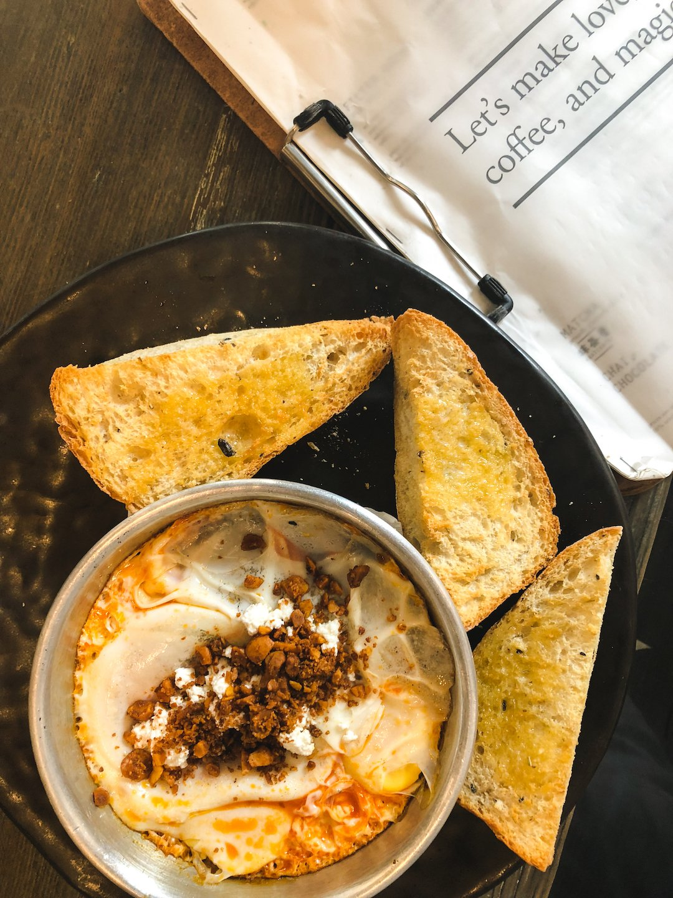
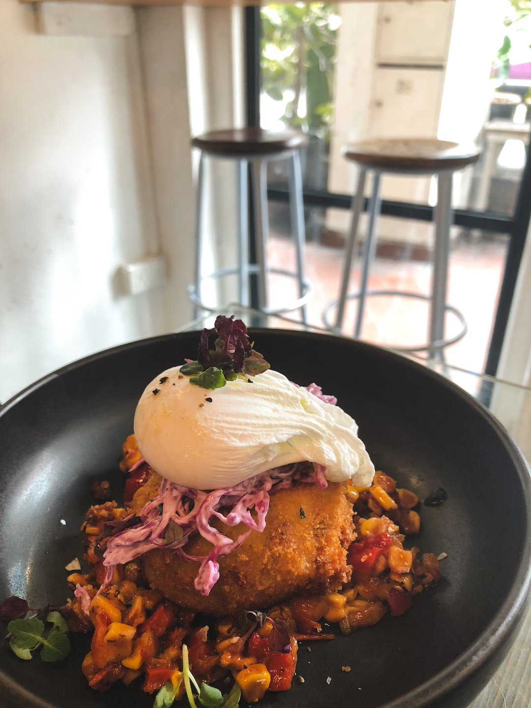
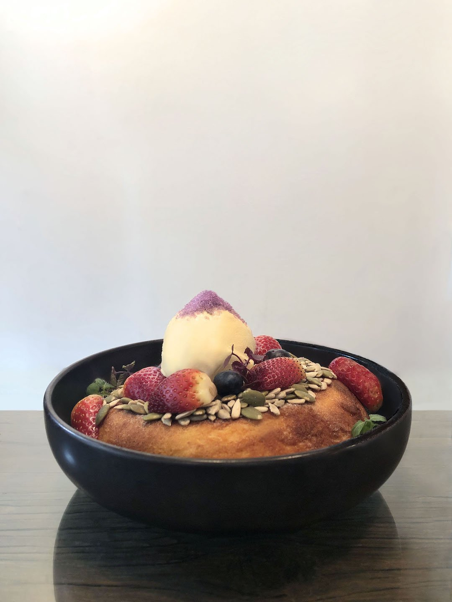
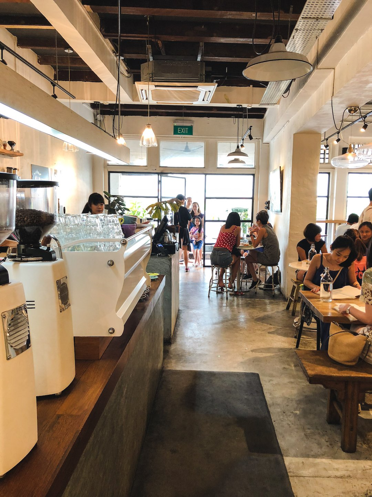

Just a stone’s throw away from Outram Park MRT station lies Strangers’ Reunion<!--more-->. The café was opened by Ryan Kieran Tan, who is well-known to have many national and international barista championship titles under his belt. With accolades like these, you know you’re in for some good coffee.

_Can you spot their awards?_

### Coffee

The Strangers’ Reunion coffee menu is very extensive, ranging from your typical espresso-based drinks to the more elusive filter brews (such as the Syphon and the Japanese Iced Brew).

Their signature drinks, “Magic” and “White Magic”, definitely lived up to expectations. “Magic” is a well-balanced double ristretto with milk, and made the perfect hot drink to perk up a cold rainy day. “White Magic” is perhaps their most recognised drink; Strangers’ Reunion’s special cold brew, served in a chic, amber glass bottle, has a deliciously milky texture and some liquor-like notes. It certainly reminded us of Baileys Irish Cream.

### Aesthetic

The modern studio aesthetic modelled by Strangers’ Reunion earned nods from us. Harsh concrete flooring and an open ceiling is softened by homely elements of wooden furniture, bright white walls and touches of indoor greenery.

_Rhubarb & Poached Pear Buttermilk Waffle_

As we mentioned, their bottled beverages are stylishly packaged and would definitely make the perfect subject for a photo to commemorate your visit. And if that isn’t enough, the carefully plated food served at Strangers’ Reunion deserves a spot on any foodie’s photo-journal.

### Seating

Strangers’ Reunion is relatively large, with ample seating and walking space. With many tables of various sizes, it can accommodate both big and small groups. (There’s even a high table with bar stools facing the storefront, which we think is the perfect setup for settling down for a good read and a nice cuppa!)

However on weekends and during peak hours, the café gets, unsurprisingly, packed so be prepared for some waiting time.

### Price

At $5.50 for the “Magic” and $6.90 for the “White Magic”, the coffee is quite fairly priced. However, if you’re planning to get in on some dining action, do come prepared to dig a little deeper into your pockets than usual. Ranging from $15 - $25, their brunch and dinner options are pretty expensive, and this price is not inclusive of the service charge and GST.

_My Father's Favourite Sandwich & Strangers Smoked Salmon_

### Food

Whether brunch or dinner, waffles or açai bowls, light bites or beer, Strangers’ Reunion has got you covered. On top of the visual feast, the food did not disappoint our palates. Below are some of the brunch and dessert options we tried.

_Spicy Baked Eggs_

_Smoked Chorizo & Melted Cheese Croquette_

_Berry Ricotta Hotcake_

---

Although slightly pricey, Strangers’ Reunion proves that you get what you pay for. Their attention to detail extends from their amazing coffee to the food they plate up. The cafe’s modern ambience has definitely made it a popular spot for a wholesome brunch experience. And we couldn’t agree more! Cheers!
