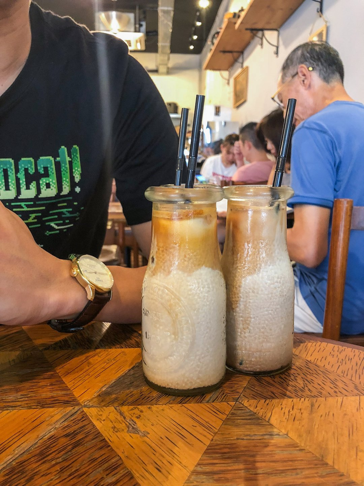
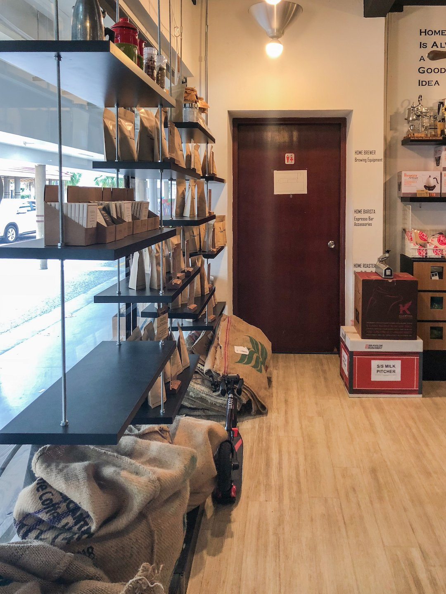
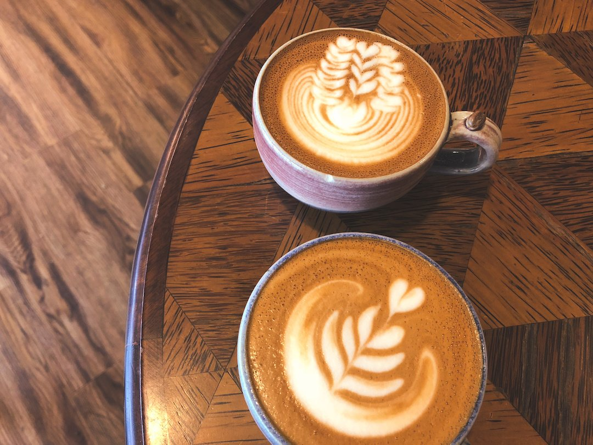
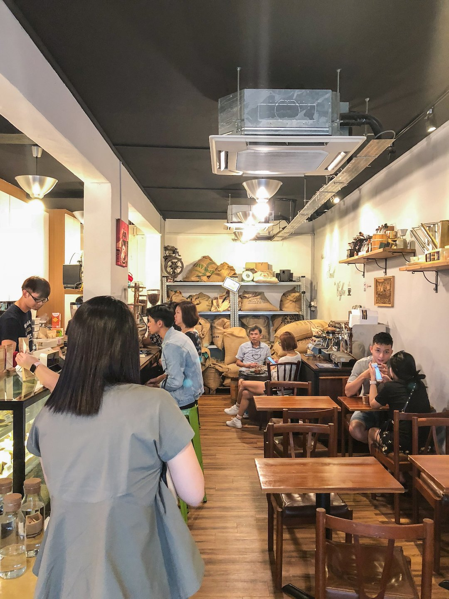
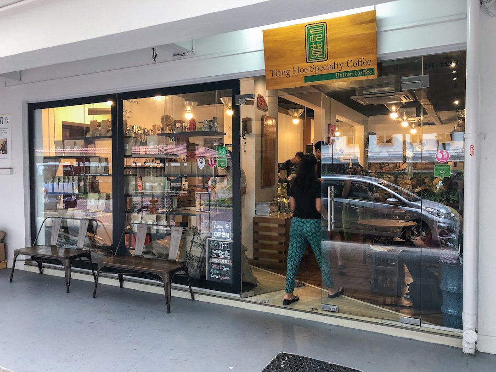

Blending in seamlessly among the ground-level HDB shops of Stirling Road, Tiong Hoe Specialty Coffee can be an easy one to miss. However, its humble storefront belies some of the best coffee that I’ve tasted.

In the 1960s, Mr Tan Tiong Hoe founded Tiong Hoe Gim Kee Trading Co. It is now one of Singapore’s oldest coffee wholesalers. In 2014, Tiong Hoe Specialty Coffee was opened to serve their own freshly
roasted beans.

### Coffee

I am no stranger to Tiong Hoe Specialty Coffee, and for a while now, it has been one of my go-to places to get a caffeine fix. On my recent visit, I placed my usual order of a cappuccino. The coffee was, unsurprisingly, fantastic. Although their coffee blends may differ each visit, the taste quality of the coffee served at Tiong Hoe remains impeccably consistent, with each cup boasting unique and pleasant flavours.

Tiong Hoe keeps their menu interesting by running what they’ve called, Single Origin Sundays (Yes, S.O.S). Each month, they pick a particular coffee bean to showcase, and on every Sunday of that month, brew their espresso-based coffees using only that bean. Check out their Instagram page to find out what the bean of the month is or you could ask their friendly baristas!

### Aesthetic

Tiong Hoe maintains a rustic vibe, with displays showcasing both old and new brewing equipment, and gunny sacks of coffee beans lying around strategically in corners or up on the shelves. Considering their long history as a coffee wholesaler, I find the vintage, warehouse-esque theme they’ve embraced very fitting. The fully glass storefront allows ample natural light into the cafe, which coupled with the warm lighting inside and delicious coffee scents, gives the establishment a very cozy feel.

Hot coffee is served in beautiful handmade ceramic cups, each unique and personal. Topped off with a flourish of skilfully created latte art, every drink is a treat for both your tastebuds and your eyes. Needless to say, the combination of natural light shining in and beautifully presented cuppa means that you will have no trouble getting that perfect aesthetic shot to impress your Instagram fans.

### Seating

Unfortunately, Tiong Hoe’s floorspace is rather small and their seats are very limited. In my estimation, they can seat about only 20 customers, and even then you should be prepared for a bit of a squeeze.

### Price

At $4.50 for a cappuccino, Tiong Hoe’s coffees are pretty affordable. However, they only accept Grab Pay or cash, so remember to come prepared!

For the home brewers out there, they also sell their own beans at the cafe, and the beans are priced very affordably as well.

### Food

Tiong Hoe’s business revolves almost exclusively around serving excellent coffee, and that is eminent in their menu. The only other non-beverage items on it include a few choices of cakes, so you can satisfy your sweet tooth as you sip your drink.

---

A hidden gem in a quiet corner of Queenstown, Tiong Hoe Specialty Coffee is the perfect coffeehouse to escape the hustle and bustle of our busy everyday lives. If you are looking for a cozy quiet place to wind down, pick up a book, and enjoy a wonderful cup of joe, Tiong Hoe is the place you’ll want to be.
